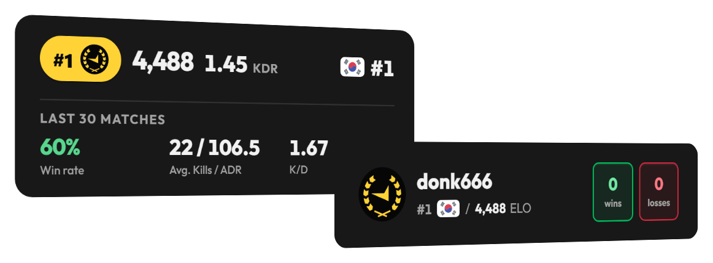

<div align="center">
  <a href="https://faceitwidget.com/">
    
  </a>

  <h1>FACEIT Widget</h1>

  <p>Live FACEIT CS2 stats for OBS browser sources.</p>

  <p>
    <a href="https://faceitwidget.com/">Create your widget</a>
    &middot;
    <a href="https://faceitwidget.com/faceit-widget-obs/">OBS setup</a>
    &middot;
    <a href="https://github.com/nachodeluca/faceitwidget">Source code</a>
  </p>

  <p>
    <a href="https://faceitwidget.com/"></a>
    <a href="https://github.com/nachodeluca/faceitwidget"></a>
    <a href="https://github.com/nachodeluca/faceitwidget/blob/main/LICENSE"></a>
  </p>
</div>

An unofficial community project for streamers. Build an overlay, choose the stats you want to show, and add the generated URL to OBS. No plugin or FACEIT login is required.

## Use it

1. Open the [widget builder](https://faceitwidget.com/builder/).
2. Enter your FACEIT nickname and choose a preset.
3. Adjust the content, style, map, and motion settings.
4. Copy the generated URL.
5. Add it as an OBS **Browser Source**.

The widget page is transparent and starts at the top-left corner. Position and crop it in OBS without changing the URL.

Read the [OBS setup guide](https://faceitwidget.com/faceit-widget-obs/) for the browser-source settings. The [live stats guide](https://faceitwidget.com/live-faceit-stats/) explains caching and match refreshes.

## What you can configure

- Presets for ELO, FACEIT level, Challenger rank, world and country rank, K/D, recent matches, and session stats.
- Visible fields, fonts, colors, scale, radius, borders, background mode, and map artwork.
- Automatic stat rotation on the larger presets.
- PNG export and share links with a generated preview image.
- Live updates after FACEIT publishes the result of a completed match.

### Requirements

- Node.js 20 or newer
- [pnpm 11](https://pnpm.io/)
- A Cloudflare account with Workers and Durable Objects.
- A server-side key from the [FACEIT for Developers](https://developers.faceit.com/apps) portal

Install the dependencies:

```bash
pnpm install
```

For local Worker development, copy `.dev.vars.example` to `.dev.vars` and set the key:

```dotenv
FACEIT_DATA_API_KEY=your-server-side-key
```

`.dev.vars` is local-only and must never be committed.

Run only the frontend while working on the UI:

```bash
pnpm dev
```

Run the static export and the Worker together when testing real FACEIT requests, WebSockets, Durable Objects, or share pages:

```bash
pnpm preview
```

### Environment variables

| Variable | Runtime | Required | Purpose |
| --- | --- | --- | --- |
| `FACEIT_DATA_API_KEY` | Worker secret | Yes | Authenticates server-side requests to FACEIT. |
| `LIVE_POLL_INTERVAL_MS` | Worker variable | No | Match-history polling interval. Defaults to `30000` and is clamped between 15 and 60 seconds. |
| `NEXT_PUBLIC_WIDGET_API_BASE_URL` | Next.js build | No | Points the browser client at a separate Worker origin during local development. |

## Project structure

```text
app/                 Routes, metadata, guides, builder, and widget page
backend/             Worker routes, FACEIT gateway, Durable Objects, and caching
components/ui/       Reusable shadcn and Base UI components
components/widget/   Widget renderer, presets, builder, and animation
lib/widget/          Config, types, serialization, ranking, and API client
public/              Level icons, flags, maps, and static assets
```

## Commands

| Command | Purpose |
| --- | --- |
| `pnpm dev` | Start the Next.js development server. |
| `pnpm preview` | Build and run the full app through Wrangler. |
| `pnpm build` | Create the static export in `out/`. |
| `pnpm test` | Run the Vitest suite. |
| `pnpm typecheck` | Check TypeScript without emitting files. |
| `pnpm lint` | Run ESLint. |
| `pnpm cf:typegen` | Regenerate Cloudflare binding types. |
| `pnpm deploy` | Build and deploy with Wrangler. |

## Deploy your own instance

Forks need their own Worker name, domain, Durable Object namespacesand FACEIT key. Update `wrangler.jsonc` before deploying.

```bash
pnpm exec wrangler login
pnpm exec wrangler secret put FACEIT_DATA_API_KEY
pnpm test
pnpm typecheck
pnpm lint
pnpm deploy
```

## Contributing

Bug reports and focused pull requests are welcome. Use the [bug report template](https://github.com/nachodeluca/faceitwidget/issues/new?template=bug_report.yml) and include the OBS or streaming-software version, widget URL, browser, and clear reproduction steps for rendering issues.

## License

MIT. See the [license file](https://github.com/nachodeluca/faceitwidget/blob/main/LICENSE).

FACEIT Widget is an unofficial community project. It is not affiliated with or endorsed by [FACEIT](https://faceit.com).
